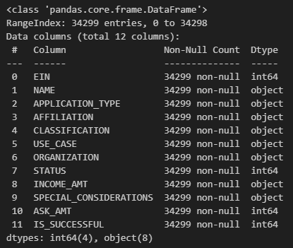

# Report on the Neural Network Model  
## Overview
- The purpose of this analysis is to create a deep leanring neural network model which can help the nonprofit foundation Alphabet Soup to select the applicants for funding with the best  chance of sucess in thier ventures.  
- The dataset is a CSV containing more than 34,000 organizations that have recieved funding from the foundation over the years. Within the dataset there are 11 columns and 34299 rows.
- this is how our data looks:  

- For the Neural Network Model we utilized the `Sequential` from `Keras`  
- The aim was to achieve the hghest accuracy which we achieved by using tuner

## Results  
- Data Preprocessing
    - What variable(s) are the target(s) for your model?
        - Our aim is to create a neural network model to predict the `IS_SUCCESSFUL`
    - What variable(s) are the features for your model?
        - The dataset contained the following features:  
        - `EIN` and `NAME`—Identification columns  
        - `APPLICATION_TYPE`—Alphabet Soup application type  
        - `AFFILIATION`—Affiliated sector of industry  
        - `CLASSIFICATION`—Government organization classification  
        - `USE_CASE`—Use case for funding  
        - `ORGANIZATION`—Organization type  
        - `STATUS`—Active status INCOME_AMT—Income classification  
        - `SPECIAL_CONSIDERATIONS`—Special considerations for application  
        - `ASK_AMT`—Funding amount requested  
        - `IS_SUCCESSFUL`—Was the money used effectively  
    - What variable(s) should be removed from the input data because they are neither targets nor features?  
        - We dropped `EIN` and `NAME` since they are for identification.
- Compiling, Training, and Evaluating the Model
    - How many neurons, layers, and activation functions did you select for your neural network model, and why? 
        -  
    - Were you able to achieve the target model performance?  
        - No
    - What steps did you take in your attempts to increase model performance?  
        - I implemented a function to optimize the model with hyperparamter options using `kerastuner` to pick the most efficient activation, number of neurons, and number of layers 

## Summary   
